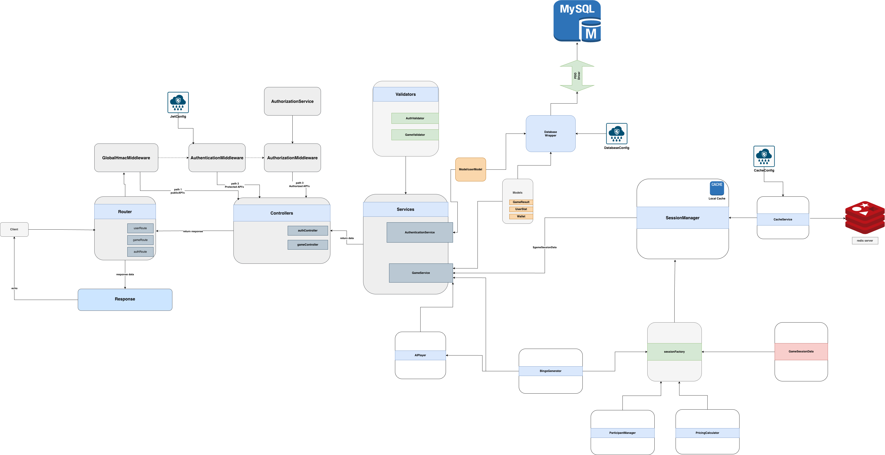

# Classic Bingo Backend

This repository contains the backend service for the Classic Bingo application.

## Architecture

A High-Level Design (HLD) diagram is provided below for a quick overview of the system architecture.

### High-Level Design (HLD)

